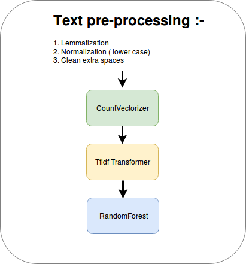
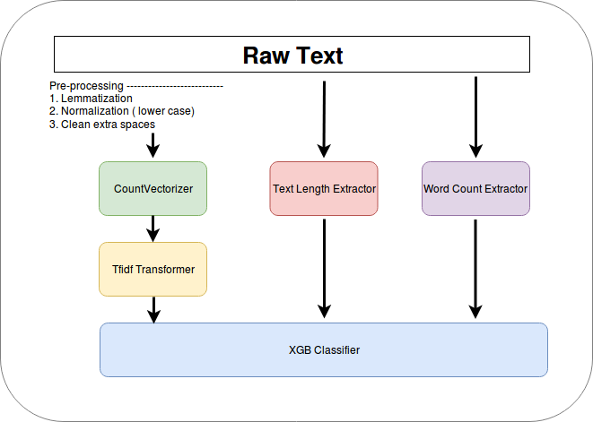
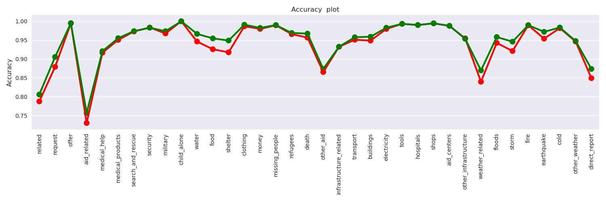

# Disaster Response Pipeline Project

### Project Overview:
   Disaster Response Pipeline Project is a multiclass - multioutput classification problem, where we are analyzing the disaster data from Figure Eight to build a model for an API that classifies disaster messages.
   
   This dataset contains 30,000 messages drawn from events including an earthquake in Haiti in 2010, an earthquake in Chile in 2010, floods in Pakistan in 2010, super-storm Sandy in the U.S.A. in 2012, and news articles spanning a large number of years and 100s of different disasters.

  The data has been encoded with 36 different categories related to disaster response and has been stripped of messages with sensitive information in their entirety.

  We have created a machine learning pipeline to categorize these incident so that model can send the messages to an appropriate disaster relief agency. 
    
   This project also include a web app where an emergency worker can input a new message and get classification results in several categories.
   
   ## Categories :
   A message can be tag into one or multiple categories. Categories are as follows :-
   * 'related' 
   * 'request' 
   * 'offer'
   * 'aid_related' 
   * 'medical_help'
   * 'medical_products'
   * 'search_and_rescue'
   * 'security'
   * 'military'
   * 'child_alone'
   * 'water'
   * 'food'
   * 'shelter',
   * 'clothing'
   * 'money'
   * 'missing_people'
   * 'refugees'
   * 'death'
   * 'other_aid',
   * 'infrastructure_related'
   * 'transport'
   * 'buildings'
   * 'electricity'
   * 'tools'
   * 'hospitals'
   * 'shops'
   * 'aid_centers'
   * 'other_infrastructure'
   * 'weather_related'
   * 'floods'
   * 'storm'
   * 'fire'
   * 'earthquake'
   * 'cold'
   * 'other_weather, 
   * 'direct_report

### Pipeline:

 > **Base Model Pipeline:**
 
 
 
 > **Tunned Model Pipeline:**
 
  

### Model Evaluation:

Model has been evaluated on different metrics like Accuracy, F1-Score, Precision and Recall.

* ***Accuracy*:  Base ML Model vs Tunned ML Model.**

### Instructions:
1. Run the following commands in the project's root directory to set up your database and model.

    - To run ETL pipeline that cleans data and stores in database
        `python data/process_data.py data/disaster_messages.csv data/disaster_categories.csv data/DisasterResponse.db`
    - To run ML pipeline that trains classifier and saves
        `python models/train_classifier.py data/DisasterResponse.db models/classifier.pkl`

2. Run the following command in the app's directory to run your web app.
    `python run.py`

3. Go to http://0.0.0.0:3001/
